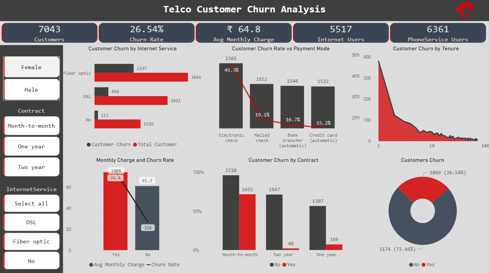

# Telco Customer Churn Analysis Dashboard

## 🧾 Project Overview
This project analyzes customer churn data to identify key factors contributing to customer attrition. The goal is to uncover actionable insights that help improve customer retention, optimize pricing strategies, and enhance overall customer experience using data-driven decision-making.

## 🎯 Business Problem
The company is experiencing significant customer churn but lacks clear insights into the underlying causes. This limits its ability to implement effective retention strategies and results in revenue loss.

## 🎯 Objectives
•	Identify key factors driving customer churn
•	Analyze customer behaviour across different services and plans
•	Evaluate the impact of pricing and payment methods on churn
•	Identify high-risk customer segments
•	Provide actionable recommendations to reduce churn

## 📂 Dataset
•	Dataset: Telco Customer Churn Data
•	Format: CSV 
•	Size: ~7,000 rows × 21 columns

## 🧹 Data Cleaning (Power BI / Excel)
•	Verified that the dataset contains no duplicate records or missing values  
•	Converted the `SeniorCitizen` column from binary (0/1) to categorical (Yes/No) for better interpretability  
•	Corrected data types (numeric and categorical) to ensure accurate analysis  
•	Standardized categorical values (Yes/No/No internet service) for consistency across the dataset  

## 📊 Dashboard Features (Power BI)
•	KPI Cards (Total Customers, Churn Rate, Average Monthly Charges, Internet Users)
•	Churn analysis by:
o	Contract type
o	Payment method
o	Internet service
•	Customer tenure analysis 
•	Monthly charges vs churn relationship
•	Interactive filters (Gender, Contract, Internet Service)

## 💡 Key Insights
•	Customers with month-to-month contracts have the highest churn, indicating lack of long-term commitment.
•	Higher monthly charges are associated with increased churn, suggesting price sensitivity among customers.
•	Electronic check is the most commonly used payment method and shows the highest churn rate.
•	Customers with tenure less than one year are more likely to churn, highlighting the importance of early engagement.
•	Customers using multiple services show lower churn rates, indicating higher engagement improves retention.
•	Fiber optic users contribute significantly to churn, suggesting potential pricing or service quality concerns.

## 🧠 Business Recommendations
•	Promote long-term contracts through discounts and incentives
•	Introduce targeted offers for high monthly charge customers
•	Encourage customers to switch to automatic payment methods
•	Improve onboarding experience for new customers
•	Enhance service quality and pricing strategies for fiber optic plans
•	Promote bundled services to increase customer engagement

## 🛠 Tools Used
•	Microsoft Excel (Data Cleaning & Preprocessing)
•	Power BI (Data Visualization & Dashboarding)
•	DAX (Calculated Measures and KPIs)

## 📸 Dashboard Preview

